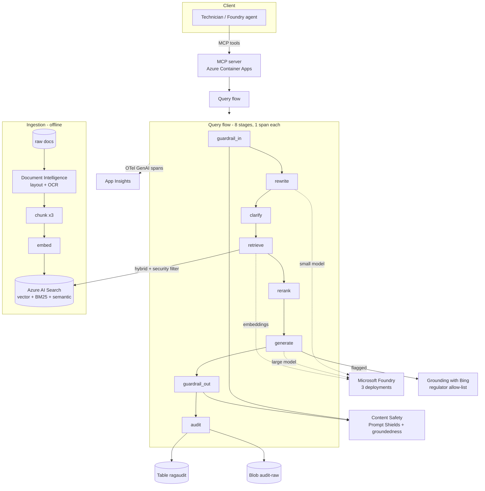
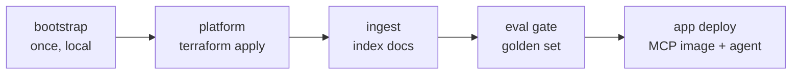

# RAG Safety-Checklist Prototype — Microsoft Foundry

A teaching-grade, GitHub-ready prototype of a Retrieval-Augmented Generation (RAG)
system for an energy company's field technicians. A technician describes a
maintenance task in plain (often messy) language and gets back a **grounded,
cited, pre-task safety checklist**: PPE, clearance distances, permits, isolation
steps and stop-work conditions — every value traced to a source document, and a
hard rule to **never invent** a distance, voltage or threshold.

It is deliberately two demos in one:

- **RAG engineering** — layout-aware parsing, three switchable chunking
  strategies, table preservation, OCR, embeddings, hybrid retrieval (vector +
  BM25 + RRF), and semantic reranking, all measured by an ablation.
- **Platform engineering** — Terraform IaC run through CI/CD, OpenTelemetry
  tracing, cost tracking, an eval gate, Content-Safety guardrails, an audit
  trail, per-user access boundaries, and an MCP server.

> ⚠️ **Prototype disclaimer.** This is a demonstration, not a certified safety
> system. Its output is **not** a substitute for site safety procedures, a live
> permit, or a competent person's assessment. The synthetic documents, values and
> prices are illustrative.

---

## Run it in 60 seconds (no Azure needed)

Everything runs locally with `MOCK_MODE=true`: deterministic fake embeddings, a
rule-based stub LLM, an in-memory hybrid index, and a local-file audit sink.

```bash
make setup      # venv + deps + generate the synthetic knowledge base
make test       # pytest (mock mode)
make demo       # all seven demos, labeled output
make eval       # eval gate against the ~40-item golden set
make ablation   # chunking x retrieval study -> results/ablation.md
make tf-check   # terraform fmt + validate + tflint on bootstrap/platform/app
```

Requires Python 3.11+ (built on 3.12). `make tf-check` additionally needs
Terraform ≥ 1.9 and TFLint; `make tf-checkov` needs Checkov; `make actionlint`
needs actionlint.

---

## Architecture



### Request flow

`guardrail_in → rewrite → clarify → retrieve → rerank → generate → guardrail_out → audit`

Outcomes: **answered** (grounded checklist), **clarified** (a question when the
hazard can't be scoped), **refused** (unauthorized / out-of-scope — never reveals
a restricted doc exists), **blocked** (a guardrail rejected the input, a poisoned
document, or an ungrounded/uncited output).

### Pipeline flow (deploy order)



---

## Prerequisites

| Tool | Why | Local demo | Azure deploy |
| --- | --- | --- | --- |
| Python 3.11+ | app, tests, eval, demos | ✅ | ✅ |
| Terraform ≥ 1.9 | IaC | for `tf-check` | ✅ |
| TFLint + azurerm ruleset | lint | for `tf-check` | ✅ |
| Checkov | security scan | optional | ✅ |
| actionlint | workflow lint | optional | optional |
| Docker | build MCP image | — | ✅ |
| Azure CLI (`az`) | auth / bootstrap | — | ✅ |
| GitHub CLI (`gh`) | push secrets/vars | — | ✅ |

## Setup checklist (empty subscription → working demo)

- [ ] 1. `make setup && make demo` — confirm the prototype works in mock mode.
- [ ] 2. Run **`infra/bootstrap`** once (see below) as an admin.
- [ ] 3. Push its outputs to GitHub secrets + variables (`gh` commands below).
- [ ] 4. Create GitHub **Environments** `dev` and `prod` (add reviewers to `prod`).
- [ ] 5. Check **model quota + regional availability** for your three deployments.
- [ ] 6. Merge to `main` → `infra.yml` applies the platform to `dev`.
- [ ] 7. Add documents under `data/` → `ingest.yml` indexes them.
- [ ] 8. Open a PR → `ci.yml` + `eval-gate.yml` run; the gate must pass.
- [ ] 9. On `main`, `deploy.yml` builds the MCP image and deploys the app + agent.
- [ ] 10. (Optional) enable `prod` via the `infra.yml` environment approval.

---

## Bootstrap walkthrough (`infra/bootstrap`)

Run **once, locally, by an admin**, with local state.

**Admin permissions required:** Application Administrator (or Cloud Application
Administrator) to create the app registration; Groups Administrator to create the
Entra groups; and Owner or User Access Administrator on the subscription to create
the deployer role assignments.

**What it creates:** the Terraform state storage account + container (versioning
and soft-delete on, shared keys disabled); the pipeline app registration +
service principal; GitHub OIDC federated credentials for `dev`, `prod` and pull
requests; Entra groups `grp-electrical` and `grp-gas`; and the deployer's role
assignments.

```bash
cd infra/bootstrap
cp terraform.tfvars.example my.tfvars   # set github_org/github_repo/subscription_id
terraform init
terraform apply -var-file=my.tfvars
```

**Copy outputs into GitHub:**

```bash
gh secret   set AZURE_CLIENT_ID        -b "$(terraform output -raw pipeline_client_id)"
gh secret   set AZURE_TENANT_ID        -b "$(terraform output -raw tenant_id)"
gh secret   set AZURE_SUBSCRIPTION_ID  -b "$(terraform output -raw subscription_id)"
gh variable set TF_VERSION               -b "1.9.8"
gh variable set TF_STATE_RESOURCE_GROUP  -b "$(terraform output -raw state_resource_group)"
gh variable set TF_STATE_STORAGE_ACCOUNT -b "$(terraform output -raw state_storage_account)"
gh variable set TF_STATE_CONTAINER       -b "$(terraform output -raw state_container)"
```

**Migrate bootstrap state to remote** (optional but recommended): add a `backend
"azurerm"` block pointing at the new state account and run
`terraform init -migrate-state`.

**az CLI fallback** (if you cannot run the azuread Terraform):

```bash
appId=$(az ad app create --display-name ragsafety-github-pipeline --query appId -o tsv)
az ad sp create --id "$appId"
az ad app federated-credential create --id "$appId" --parameters '{
  "name":"github-dev","issuer":"https://token.actions.githubusercontent.com",
  "subject":"repo:ORG/REPO:environment:dev","audiences":["api://AzureADTokenExchange"]}'
# repeat for environment:prod and for pull_request
```

---

## Permissions model

### Deployer (pipeline service principal)

| Role | Scope | Why |
| --- | --- | --- |
| Contributor | subscription (narrow to the target RGs in prod) | create/modify the platform resources |
| Role Based Access Control Administrator | subscription, **ABAC-constrained** to this solution's role GUIDs | let Terraform create the runtime identity's role assignments without being able to grant arbitrary roles |
| Storage Blob Data Contributor | state storage account | read/write Terraform state over Entra ID (shared keys are disabled) |

### Runtime managed identity (one user-assigned identity for app + jobs)

| Role | Scope | Why |
| --- | --- | --- |
| Cognitive Services OpenAI User | Foundry account | call chat/embedding deployments |
| Cognitive Services User | Foundry account | read account metadata / data-plane access |
| Azure AI Developer *(Foundry role family; verify)* | Foundry project | register the agent + MCP tool, run evaluation |
| Search Index Data Contributor | AI Search | write/query the index (data plane) |
| Search Service Contributor | AI Search | create/update the index schema |
| Storage Blob Data Contributor | storage | write `audit-raw` blobs, read `raw-docs` |
| Storage Table Data Contributor | storage | write the `ragaudit` table |
| Key Vault Secrets User | Key Vault | read secrets (RBAC auth; no access policies) |
| AcrPull | ACR | pull the MCP image |

Key-based auth is disabled wherever the service supports it (`local_auth_enabled`
/ `shared_access_key_enabled` / `local_authentication_enabled`), so every data
path is Entra-ID only.

---

## Terraform

### Provider choices

- **azurerm `~> 4.40`** — the default provider: resource group, identity + RBAC,
  Log Analytics + App Insights, Key Vault, Storage, AI Search, Document
  Intelligence, Content Safety, ACR, Container Apps.
- **azapi `~> 2.5`** — only where azurerm can't express the resource, each use
  commented with the reason:
  - the **Foundry** account + project (`Microsoft.CognitiveServices/accounts`
    kind `AIServices`, API `2025-06-01`) and its model deployments — the new
    Foundry shape, pinned to the Microsoft Learn-documented API so it doesn't
    depend on azurerm exposing `azurerm_cognitive_account_project`;
  - **Grounding with Bing** account + Foundry connection (feature-flagged).
- **azuread `~> 3.0`** — Entra objects (app registration, groups, federated
  credentials), **bootstrap stack only**.

### Module & root walkthrough

| Path | What |
| --- | --- |
| `infra/modules/monitoring` | Log Analytics + workspace-based App Insights |
| `infra/modules/keyvault` | RBAC-auth Key Vault, purge protection |
| `infra/modules/storage` | `raw-docs` + `audit-raw` containers, `ragaudit` table; shared keys off |
| `infra/modules/acr` | Container registry, admin disabled |
| `infra/modules/search` | AI Search with semantic ranker, local auth off |
| `infra/modules/document_intelligence` | Cognitive account kind `FormRecognizer` |
| `infra/modules/content_safety` | Cognitive account kind `ContentSafety` |
| `infra/modules/foundry` | Foundry account + project + 3 deployments (azapi) |
| `infra/modules/bing_grounding` | Grounding with Bing (azapi, `enabled` flag) |
| `infra/modules/container_apps_env` | Container Apps managed environment |
| `infra/modules/identity_rbac` | the runtime UAMI + **all** its role assignments |
| `infra/bootstrap` | run-once admin stack (state, OIDC, groups, RBAC) — local state |
| `infra/platform` | composes the platform; one remote state per env |
| `infra/app` | the MCP Container App; reads platform via `terraform_remote_state` |
| `infra/envs/dev\|prod` | `*.tfvars` + `backend.hcl` per environment |

### State layout & the platform/app split

The azurerm backend uses `use_oidc = true` and `use_azuread_auth = true`, with a
**separate state key per environment and per root** (`dev/platform.tfstate`,
`dev/app.tfstate`, …) and blob-lease locking. The MCP app lives in its own root
so an image bump re-plans only the Container App — **no `-target`**, and platform
applies and app deploys never block each other.

### Plan/apply: local vs pipeline

```bash
# local (dev platform)
terraform -chdir=infra/platform init -backend-config=../envs/dev/backend.hcl
terraform -chdir=infra/platform plan  -var-file=../envs/dev/dev.tfvars -out tfplan
terraform -chdir=infra/platform apply tfplan
```

In CI the same runs under OIDC (`ARM_USE_OIDC=true`, no secrets in state). `ci.yml`
plans on PRs and comments the summary; `infra.yml` applies the saved plan to `dev`
then `prod` (behind a GitHub Environment approval).

### Terraform vs Python ownership

Terraform owns every control-plane resource, all identities and all RBAC. Python
owns only the data-plane operations Terraform can't reliably manage:

| Concern | Owner | Why |
| --- | --- | --- |
| RG, Foundry, deployments, Search, DocIntel, Content Safety, Storage, ACR, ACA env, Key Vault, monitoring, UAMI, **all RBAC** | Terraform | control-plane |
| Grounding-with-Bing connection | Terraform (azapi, flagged) | control-plane, not in azurerm |
| AI Search **index schema** | Python (`scripts/build_index.py`) | schema is code; changes with chunking strategy; no stable TF path |
| Document **ingestion** | Python (`scripts/ingest.py`) | data-plane |
| Foundry **agent + MCP tool** registration | Python (`scripts/register_agent.py`) | data-plane SDK |
| **Evaluation** | Python (`eval/`) | data-plane |
| MCP **Container App** | Terraform (`infra/app`) | control-plane, split root for fast image deploys |

### Drift, teardown, common errors

- **Drift:** `drift.yml` runs `terraform plan -detailed-exitcode` nightly per env
  and opens an issue (and fails) on exit code 2.
- **Teardown:** `destroy.yml` is manual, requires the environment approval and
  typing the environment name, and destroys the app stack then the platform.
- **Common errors:** provider registration (`az provider register --namespace
  Microsoft.CognitiveServices`), model **quota/region availability** (deployments
  fail if the model isn't available or quota is 0 in the region), and **role
  propagation delay** (RBAC can take minutes — re-run apply if a data-plane step
  races the grant).

---

## Azure resources (purpose, SKU, cost notes)

Prices change constantly — treat these as directional. `config/pricing.yaml`
holds token prices (marked `verify: true`).

| Resource | Purpose | SKU | Cost note |
| --- | --- | --- | --- |
| Microsoft Foundry (AIServices) | model deployments + agent | S0 | pay per token; the small/large split keeps the cheap model on most calls |
| — 3 deployments | small chat, large chat, embeddings | Global Standard / Standard | capacity = TPM; right-size per region quota |
| AI Search | hybrid + semantic index | Standard, semantic ranker standard | hourly per replica/partition; semantic ranker adds per-query cost |
| Document Intelligence | layout + OCR | S0 | per page |
| Content Safety | Prompt Shields + groundedness | S0 | per call |
| Storage | audit table + blob + raw docs | Standard LRS | cheap; LRS for a prototype |
| Key Vault | secrets | Standard | per-operation; minimal |
| ACR | MCP image | Standard | per-GB storage + bandwidth |
| Container Apps env + app | MCP server | consumption | scale-to-N; pay per vCPU-s |
| Log Analytics + App Insights | traces, KQL | PerGB2018 | per-GB ingested |

---

## GitHub secrets vs variables

| Kind | Name | Source |
| --- | --- | --- |
| secret | `AZURE_CLIENT_ID` | bootstrap `pipeline_client_id` |
| secret | `AZURE_TENANT_ID` | bootstrap `tenant_id` |
| secret | `AZURE_SUBSCRIPTION_ID` | bootstrap `subscription_id` |
| variable | `TF_VERSION` | you pick (e.g. `1.9.8`) |
| variable | `TF_STATE_RESOURCE_GROUP` | bootstrap `state_resource_group` |
| variable | `TF_STATE_STORAGE_ACCOUNT` | bootstrap `state_storage_account` |
| variable | `TF_STATE_CONTAINER` | bootstrap `state_container` |

Use GitHub **Environments** `dev` and `prod` (add required reviewers to `prod`).

---

## Repository map (per-file purpose)

**App package (`src/ragsafety/`)**

| File | Purpose |
| --- | --- |
| `settings.py` | pydantic-settings config + YAML loaders |
| `schema.py` | pydantic models (`Chunk`, `Checklist`, `AuditRecord`, …) |
| `concepts.py` | concept detection + category mapping (shared) |
| `extraction.py` | grounded fact extraction + groundedness check |
| `security.py` | persona groups + domain authorization |
| `cost.py` | token cost from `pricing.yaml` |
| `tracing.py` | OpenTelemetry (GenAI conventions) setup |
| `flow.py` | the 8-stage orchestration |
| `app.py` | ingest + answer entrypoint |
| `clients/` | `base` interfaces + `embeddings`/`llm`/`search`/`docintel`/`contentsafety`/`web`/`audit` (mock + Azure) |
| `pipeline/` | `parse`, `chunk` (3 strategies), `embed_index`, `retrieve`, `generate` |
| `mcp_server/` | `tools` (pure logic), `server` (MCP SDK, MCPServer), `Dockerfile` |

**Scripts** (`scripts/`): `generate_data.py` (synthetic KB), `build_index.py`
(index schema), `ingest.py` (parse→chunk→embed→index), `register_agent.py`
(Foundry agent + MCP tool), `cost_report.py` (cost per user/day + App Insights
KQL).

**Eval** (`eval/`): `golden_set.jsonl` (~40 items), `run_eval.py` (the gate),
`ablation.py` (chunking × retrieval → `results/ablation.md`), `_common.py`.

**Demos** (`demos/`): seven runnable scenarios (see below).

**Workflows** (`.github/workflows/`): `ci`, `infra`, `drift`, `ingest`,
`eval-gate`, `deploy`, `destroy`.

---

## RAG concepts, explained with this repo's own ablation

Run `make ablation` to (re)generate [`results/ablation.md`](results/ablation.md).
Numbers vary per run; the *shape* is the lesson. The synthetic documents plant
traps so each concept is measurable:

- **Chunking & overlap** — `fixed_no_overlap` splits a rule whose condition and
  value straddle a window; `fixed_overlap` and `section_aware` keep them together
  (adjacent overlap windows share boundary tokens).
- **Layout-aware section splits** — only `section_aware` prepends the heading path,
  so a retrieved value (e.g. the elevated-clearance `1.20 m`) keeps the condition
  it applies to.
- **Table preservation** — the arc-flash PPE table spans a page break;
  `section_aware` merges the continuation into **one typed table chunk** holding
  CAT 1–4, while fixed chunking orphans rows (see the ablation's page-spanning
  example).
- **OCR** — the lifting poster is image-only; its sling-angle factors are reachable
  only through OCR of the PNG.
- **BM25 vs vector vs hybrid (RRF)** — exact codes (`GV-17`, `TX-400`) favor BM25;
  paraphrases (“visible clothing” → hi-vis) favor vectors; hybrid RRF gets both.
- **Reranking** — near-duplicate rows (11 kV vs 33 kV) are separated by the
  semantic reranker (visible as a rank change on `tab2`).

The ablation also shows a concrete **cost/structure** difference: section-aware
produces fewer, self-contained chunks (lower embedding/query cost) than the
over-splitting fixed strategies.

---

## LLM selection rationale

The pipeline uses a **tiered** split and a dedicated embedding model:

- **small chat** (e.g. `gpt-4o-mini`) for query rewrite, intent/ambiguity
  classification and clarification — cheap, fast, runs on every query;
- **large chat** (e.g. `gpt-4o`) for the final, safety-critical checklist — chosen
  for grounded extraction accuracy and structured-output reliability;
- **embeddings** (`text-embedding-3-large`, dims reducible) for retrieval quality
  at a controllable vector size.

**Decision criteria** (and where they're exercised): grounded extraction accuracy
(safety-critical — the eval's groundedness/citation metrics); instruction
following + structured output (the strict `Checklist` JSON); latency for field use
+ cost per query (budget thresholds, `cost_report.py`); context window (fits the
retrieved chunks); regional availability + data residency (deployment region);
Foundry availability (must be deployable as a Foundry model).

| Criterion | Weight | small | large |
| --- | --- | --- | --- |
| grounded accuracy | ★★★ | ok | best |
| structured output | ★★★ | ok | best |
| latency | ★★ | best | ok |
| cost/query | ★★ | best | ok |
| context window | ★★ | ok | best |

Re-run the bake-off by pointing `RAGSAFETY_CHAT_LARGE_DEPLOYMENT` at a candidate
and running `make eval` (compare groundedness/citation/cost/latency), then the
ablation for retrieval settings.

---

## Tracing, cost, audit, guardrails, eval

- **Tracing** — OpenTelemetry with GenAI semantic conventions; a span per stage
  (`guardrail_in … audit`) with `gen_ai.*` token attributes. Console exporter in
  mock mode; App Insights in Azure. View traces in Foundry / App Insights;
  per-stage token KQL is printed by `scripts/cost_report.py`.
- **Cost** — token usage recorded on every call; cost computed from
  `config/pricing.yaml`; aggregated per user/day (audit table) and per stage
  (App Insights KQL).
- **Audit** — one `AuditRecord` per query to Table `ragaudit` (PartitionKey=date,
  RowKey=trace_id) and the full redacted JSON to blob `audit-raw`; free-text
  fields are PII-redacted.
- **Guardrails** — Content Safety on input (Prompt Shields/jailbreak, harmful,
  off-topic), on retrieved documents (indirect injection), and on output
  (groundedness + mandatory citations). Hard rule: never invent a value → stop
  work and contact a supervisor.
- **Eval gate** — `eval/run_eval.py` scores groundedness, relevance, recall@5,
  citation accuracy, refusal/clarification/jailbreak correctness, and
  cost/latency against `config/eval_thresholds.yaml`; CI fails on a miss.

---

## Demos (expected output)

| Demo | Shows |
| --- | --- |
| `demo1_boundaries` | Priya vs Marcus; Marcus **refused** on HV; shared content for both |
| `demo2_messy_prompt` | messy query rewritten (`tx400`→`TX-400`, `sub 4`→`substation 4`) then a checklist |
| `demo3_clarification` | ambiguous “line job” → a question, then an answer after the reply |
| `demo4_ocr` | sling capacity factor `0.71` answered only from the poster PNG |
| `demo5_web_grounding` | regulator guidance labeled separately from internal policy |
| `demo6_guardrails` | a jailbreak and a planted indirect injection, both **blocked** |
| `demo7_cost_tracing` | the 8 GenAI spans, then `cost_report.py` aggregation |

Run one: `PYTHONPATH=src RAGSAFETY_MOCK_MODE=true python demos/demo1_boundaries.py`.

---

## Troubleshooting

- **“No source documents”** → run `python scripts/generate_data.py` (or `make data`).
- **`terraform` not found in `tf-check`** → install Terraform ≥ 1.9 and TFLint.
- **Plan/apply auth errors** → confirm the GitHub Environment, OIDC federated
  credential subject (`repo:ORG/REPO:environment:<env>`), and the three secrets.
- **Deployment fails on model** → check quota + regional availability for the
  model/version in `infra/platform` `var.deployments`.
- **RBAC race** → role propagation can lag; re-run the failing data-plane job.

## Known limitations

- Mock mode approximates Azure behaviour; real embeddings/ranker/model will shift
  the numbers.
- The security scan (`infra/.checkov.yaml`) **suppresses** private-endpoint, CMK,
  storage-logging and replication checks — deliberate prototype scope, documented
  there. Production should add private networking, CMK, and storage logging.
- Items marked `# VERIFY:` (Foundry/Bing APIs, role GUIDs, SDK surfaces, prices,
  model versions) must be confirmed against current Microsoft docs before real use.

See [`PLAN.md`](PLAN.md) for the architecture/build plan and the verified-facts table.
